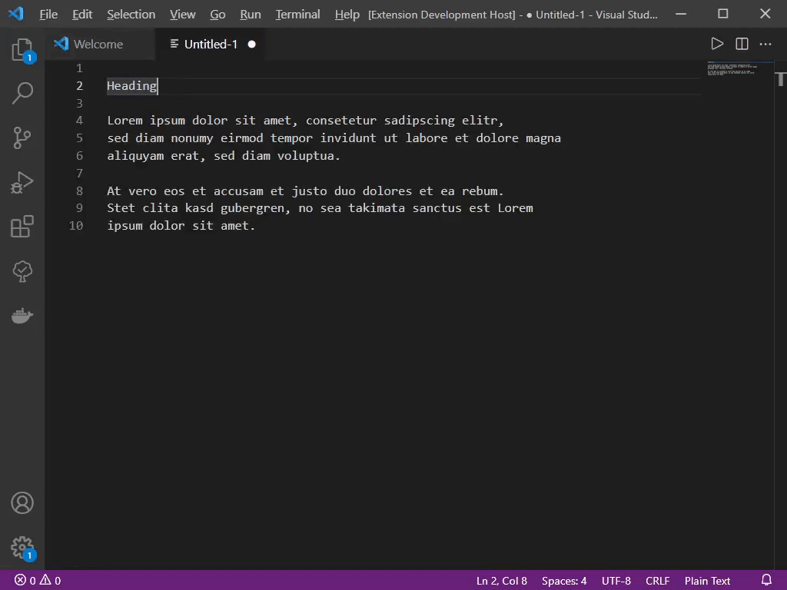

# Heading Creator
Small Visual Studio Code extension that allows to structure code by formatting a line to a heading.

## Extension Settings

Include if your extension adds any VS Code settings through the `contributes.configuration` extension point.

For example:

This extension contributes the following settings:

* `heading-creator.fillCharacter`: the fill character used for the heading borders
* `heading-creator.minimumBorderSize`: the minimum amount of border character printed to the left and right of the actual heading value
* `heading-creator.commentBegin`: Begin of each line (should usually be a comment delimiter of the programming language you are using)
* `heading-creator.commentEnd`: End of each line (should usually be a comment delimiter of the programming language you are using)

## Known Issues

Currently only supports headings spaning one line. Multi-line headings might follow soon though.

<!-- Release Notes

Users appreciate release notes as you update your extension.

### 1.0.0

Initial release of ...

### 1.0.1

Fixed issue #.

### 1.1.0

Added features X, Y, and Z.
-->
